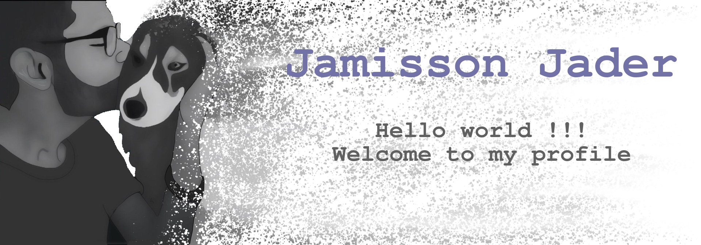

 

# Hi there! 

 

My name is Jamisson and I am from Brazil. I am currently taking the Computer Engineering degree. At my university I am working with data science, robotics, mobile development and simulation projects. I love dogs and I am very lucky to have the friends I have ❤️

- 🔭 I’m currently working at [Locobots](https://locobots.github.io/pages/sobre.html#sobre)
- 🌱 I’m currently learning Data Science 
- 📫 How to reach me: jjader03@gmail.com
- 😄 Pronouns: He/His
- ⚡ Fun fact: In my fraternity my nickname is Nissin because I ate a lot of noodles 🍜

 

  
<b>My projects</b>

  
  

  
   
  
  

  

   
   
   

  

  

  

  
  
  

